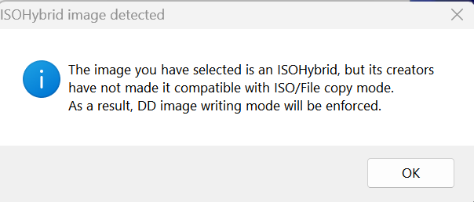

# Create Proxmox ISO

## Goal
Download the latest Proxmox ISO and flash it to a USB drive using a Windows laptop. This USB drive will be used to install Proxmox on the Intel NUC.

## Requirements
- Windows laptop with admin privileges
- USB-A drive (8GB minimum)
    - **Note**: any pre-existing data on drive will be erased
- Flashing software: [Rufus](https://rufus.ie/) (preferred)
- Internet access

## Procedure

1. **Download Proxmox ISO**
   - Visit: [https://www.proxmox.com/en/downloads](https://www.proxmox.com/en/downloads)
   - Download the latest **Proxmox VE ISO Installer**

2. **Verify SHA-256 Checksum (Optional but Recommended)**
   - Open PowerShell on your Windows laptop
   - Run the following command (adjust path as needed):
     ```powershell
     Get-FileHash -Path "C:\Path\To\proxmox-ve_*.iso" -Algorithm SHA256
     ```
   - Compare the result with the SHA-256 hash listed on the [Proxmox Downloads Page](https://www.proxmox.com/en/downloads)

3. **Download and Launch Rufus**
   - Go to: [https://rufus.ie](https://rufus.ie)
   - Download the latest version of **Rufus Portable**
   - Launch Rufus (no installation required)

4. **Insert USB-A Drive**
   - Plug in a USB-A flash drive (8GB minimum)
   - Rufus will auto-detect the device

5. **Flash the ISO with Rufus**
   - In Rufus, select the following options:
     - Device: Select your USB drive
     - Boot selection: Use the "SELECT" dropdown to choose the downloaded Proxmox ISO
        - **Note**: Rufus will enforce DD mode. Click OK:

    <p align="center">
      
    </p>
           
     - Partition scheme: `MBR` (default)
        - **Note**: Although GPT is often used with UEFI, Proxmox ISO works with `MBR + UEFI` boot on most Intel NUCs.
          You can leave the default MBR setting in Rufus unless your system specifically requires GPT.
     - File system: `FAT32` (default)
  - Confirm the following options:

    <p align="center">
      
    </p>

   - Click **Start**. Confirm that all existing data on the drive will be erased.

6. **Verify Completion**
   - Wait for Rufus to finish writing and validating the image
   - Safely eject the USB-A drive when done

## Resources
- [Proxmox ISO Downloads](https://www.proxmox.com/en/downloads)
- [Rufus Guide](https://github.com/pbatard/rufus/wiki/FAQ)
- [Proxmox Installation Docs](https://pve.proxmox.com/wiki/Installation)
