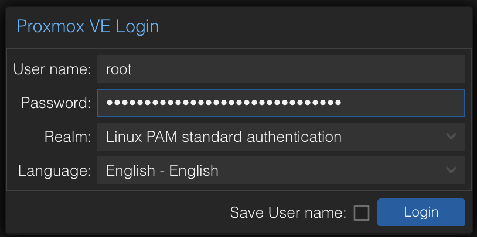
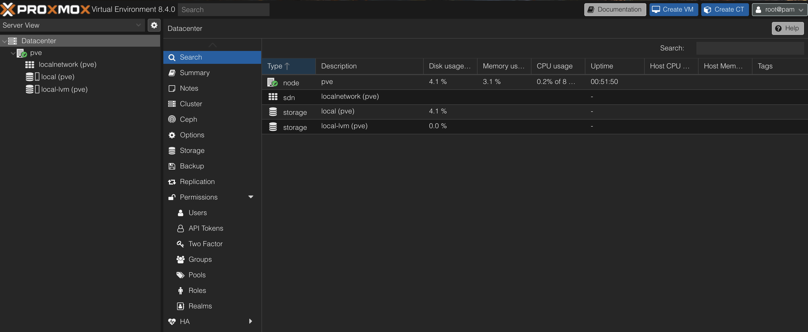

# Access the Proxmox Web Interface

## Goal
Connect to the Proxmox VE web interface from another device on the local network and confirm successful installation.

## Requirements
- Proxmox VE server, successfully installed and powered on
- A second client machine (e.g., MacBook, laptop, or desktop) on the same local network
- Web browser (Firefox recommended)
- Proxmox server IP address (displayed on console after boot)

## Procedure

1. **Find the Proxmox IP Address**
   - On the Proxmox server’s console screen, look for the following message:
```
You can now connect to the Proxmox VE web interface: https://[PXMX_IP_ADDR]:8006
```

2. **Open the Web Interface**
   - On your client machine, open a browser and go to:
```
https://[PXMX_IP_ADDR]:8006
```

3. **Bypass the SSL Warning**
   - Proxmox uses a self-signed certificate by default.
       - In Firefox, click "Advanced" → "Accept the Risk and Continue"
       - In Safari or Chrome, click "Show Details" → "Visit this website"

4. **Log In**

    <p align="center">
      
    </p>

    - Log in with the root user and the password you set during installation.
        - **Note**: To log in as the `root` user, you must select the `Linux PAM` realm (`@pam`) from the login
          dropdown. See [Appendix: Authentication in Proxmox VE](#appendix-authentication-in-proxmox-ve) for more
          details.
        - Disregard the warning that you do not have a valid subscription.
    - You should now see the Proxmox dashboard.

     <p align="center">
       
     </p>

5. **Run Proxmox Post-Installation Script**  
   - Visit the official community Proxmox helper scripts index for post-install options:

```
https://community-scripts.github.io/ProxmoxVE/scripts?id=post-pve-install
```
   - Review the post-installation script:

```
https://raw.githubusercontent.com/community-scripts/ProxmoxVE/main/tools/pve/post-pve-install.sh
```
   - This script configures commonly used post-install options:  
       - **Repository Configuration**
           - Debian Sources: Sets up proper Debian Bookworm package sources
           - Enterprise Repository: Disables paid subscription repository (not needed for home labs)
           - No-Subscription Repository: Enables free community repository for updates
           - Ceph Repositories: Configures storage cluster repositories (initially disabled)
           - Test Repository: Optionally adds bleeding-edge testing repository (disabled)
       - **System Optimizations**
           - Subscription Nag: Removes the subscription reminder from web UI
           - High Availability: Manages HA services (can disable for single-node set-ups)
           - System Updates: Performs full system package upgrade
           - Reboot: Optional restart after configuration
       - **Warning:** This script is community-maintained. Review its contents before running. Not recommended for production systems.
   - Run on your Proxmox host:  
```bash
bash -c "$(curl -fsSL https://raw.githubusercontent.com/community-scripts/ProxmoxVE/main/tools/pve/post-pve-install.sh)"
```
   - Recommended options for home labs:
       - Enable no-subscription repository
       - Disable enterprise repository
       - Remove subscription nag
       - Disable HA services (not necessary for single-node set-up)
       - Disable Corosync (not necessary for single-node set-up)
       - Update system packages to latest available versions
   - When prompted, reboot system.
   - After system has rebooted, upgrade packages and install productivity tools:
```bash
apt update && apt full-upgrade && apt install -y vim tmux btop
```


## Troubleshooting

If the web interface doesn't load, but the Proxmox server shows the IP address, try the following steps:


1. Test basic connectivity:
- From your client machine, open a terminal and run:

```bash
ping [PXMX_IP_ADDR]
```

- If the ping fails:
   - Make sure the client and Proxmox server are on the same subnet
   - Verify that the Ethernet cable is securely connected
   - Check your router's DHCP leases to confirm the NUC was assigned an IP
   - Try assigning a static IP and rebooting the system

2. Use curl to test the HTTPS service:

- From the terminal on your client machine, run:
```bash
curl -k https://[PXMX_IP_ADDR]:8006
```

- If curl pulls HTML content, then the Proxmox web service is working. The issue is likely browser-related.

3. Check if the web service is running on the server:
- On the Proxmox console, run:
```bash
systemctl status pveproxy
```

- If the service is not active, restart:
```bash
systemctl restart pveproxy
```

4. Local network access blocked by macOS or browser:
- On macOS, navigate to *System Settings > Network > Privacy & Security > Local Network*
    - Ensure Firefox (or your browser) is allowed to access the local network
- If prompted by the browser, choose to allow access to devices on your local network

5. Try a different browser:
- Firefox is recommended, as it's more permissive with self-signed certificates. Safari and Chrome are stricter and may
cache certificate errors.

## Resources

- [Proxmox VE Web Interface Overview](https://pve.proxmox.com/wiki/Proxmox_VE_User_Interface)
- [Proxmox VE Authentication Realms](https://pve.proxmox.com/wiki/User_Management#_authentication_realms)
- [Proxmox VE User Management](https://pve.proxmox.com/wiki/User_Management)
- [Proxmox VE Certificates and HTTPS Access](https://pve.proxmox.com/wiki/HTTPS_Certificate_Configuration)
- [Proxmox VE System Requirements](https://pve.proxmox.com/wiki/System_Requirements)
- [Proxmox Community Forum](https://forum.proxmox.com/)
  - Useful for troubleshooting login or certificate issues
- [Proxmox VE Helper Scripts](https://community-scripts.github.io/ProxmoxVE/)
  - Community-maintained (not official Proxmox scripts)

## Appendix: Authentication in Proxmox VE

When logging into the Proxmox web interface, you must choose an **authentication realm**. This determines how your
credentials are verified. The following realms are available:

- **Linux PAM (`@pam`)**
  - Authenticates against the underlying Linux system (Debian)
  - Uses accounts stored in `/etc/passwd` and `/etc/shadow`
  - Recommended for administrative access via the `root` account
  - Example login: `root@pam`

- **Proxmox VE (`@pve`)**
  - Authenticates users stored in Proxmox’s internal user database
  - Supports fine-grained, role-based access control
  - Recommended for non-root or restricted users
  - Example login: `admin@pve`


