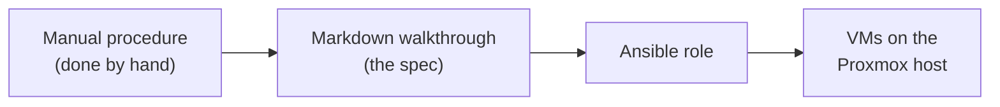
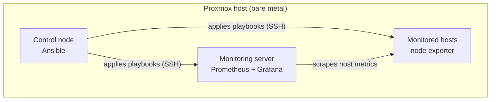

# homelab-net

The infrastructure behind my home network, documented and automated. The goal
is to see what every host on the network is doing (CPU, memory, disk, and
network) from one set of dashboards.

Everything runs on a single Proxmox VE hypervisor and is configured from a
dedicated Ansible control node. I run it the way I'd run production
infrastructure. Each procedure is done by hand first and written up as a
walkthrough. That walkthrough becomes the spec for an Ansible role that
reproduces the result and is safe to rerun. When something breaks, it gets a
post-mortem.

> **Note:** The walkthroughs record the original manual build on Debian 12 and
> are kept as written. The Ansible roles now target Debian 13 and, with the
> [ADRs](docs/adr/), are the source of truth. See [`ROADMAP.md`](ROADMAP.md)
> for the plan.

```mermaid
flowchart LR
    manual["Manual procedure<br/>(done by hand)"] --> walkthrough["Markdown walkthrough<br/>(the spec)"]
    walkthrough --> role["Ansible role"]
    role --> hosts["VMs on the<br/>Proxmox host"]
```

## Architecture

```mermaid
flowchart TB
    subgraph proxmox["Proxmox host (bare metal)"]
        control["Control node<br/>Ansible"]
        monitoring["Monitoring server<br/>Prometheus + Grafana"]
        monitored["Monitored hosts<br/>node exporter"]
    end

    control -- "applies playbooks (SSH)" --> monitoring
    control -- "applies playbooks (SSH)" --> monitored
    monitoring -- "scrapes host metrics" --> monitored
```

## Layout

The numbered directories follow the order in which the lab is built.

| Path | Contents |
| --- | --- |
| [`01_proxmox-setup/`](01_proxmox-setup/) | Installing Proxmox VE on the bare-metal host and first access to the web UI |
| [`02_ansible-ctl-node/`](02_ansible-ctl-node/) | Creating the Debian VM that serves as the Ansible control node |
| [`03_net-monit-stack/`](03_net-monit-stack/) | Monitoring stack procedures, with `manual/` walkthroughs and an `automated/` runbook |
| [`playbooks/`](playbooks/) | Ansible playbooks, roles, and a placeholder inventory (`inventory/hosts.example`) |
| [`scripts/`](scripts/) | Standalone utilities, such as a UPS/NUT power event report for the Proxmox host |
| [`docs/`](docs/) | Knowledge base, standalone walkthroughs, and post-mortems |
| [`res/`](res/) | Screenshots, config files, and templates |

## Monitoring stack

The monitoring walkthroughs are organized in three layers:

1. **[Node metrics](03_net-monit-stack/manual/01_node-metrics.md):** Prometheus
   and Grafana on the monitoring server, with node exporter on each monitored
   host.
2. **[Service metrics](03_net-monit-stack/manual/02_service-metrics.md):**
   DNS visibility and service uptime (Pi-hole, Unbound, Uptime Kuma).
3. **[System metrics](03_net-monit-stack/manual/03_system-metrics.md):** WAN
   performance and external reachability (Speedtest CLI, Blackbox Exporter,
   SNMP Exporter).

Node metrics has a complete walkthrough and is the current focus for
automation. The service and system layers are outlines for now.

## Status and caveats

- The procedures were written for Debian 12 around 2024. Version-specific steps
  (package names, repositories, config paths) may be out of date, so check them
  before relying on them.
- The Ansible side currently has a `common` role that is applied to every host.
  It updates packages, installs baseline tooling and node exporter, and sets up
  the admin user. Roles for the rest of the monitoring stack are in progress.

## Using the playbooks

See [`playbooks/README.md`](playbooks/README.md) for control node
prerequisites, SSH setup, and how to run `site.yml`. The real inventory is
gitignored. To use your own, copy `playbooks/inventory/hosts.example` to
`playbooks/inventory/hosts` and fill it in.

## License

This project is licensed under the MIT License. See [LICENSE](LICENSE) for
details.
