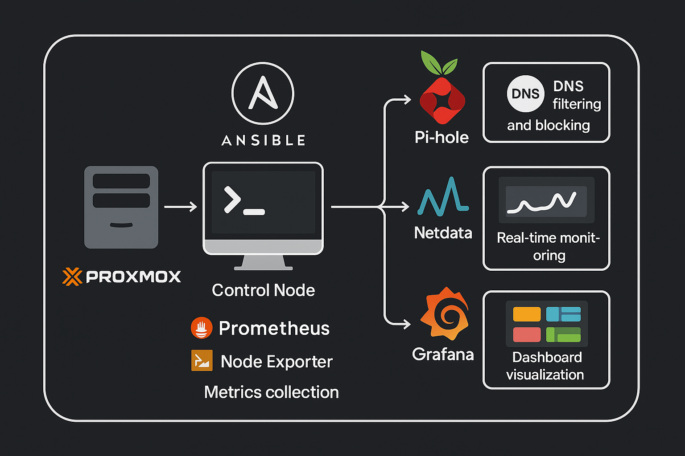

# homelab-net

A modular, infrastructure-as-code project to stand up a network monitoring stack on a self-hosted Proxmox environment.

<p align="center">
  
</p>

This repository documents and automates the deployment of key components for observability, diagnostics, and internal
tooling using lightweight VMs and containers.

## Goal

Build a flexible, documented homelab network stack that enables visibility, experimentation, and modern infrastructure
automation.

## Overview

This project is structured into three major phases:

### 1. Proxmox Set-up
Install and configure the Proxmox VE hypervisor on a bare-metal Intel NUC, including BIOS tuning, static IP assignment,
and first access via the web UI.

### 2. Ansible Control Node
Create a dedicated VM or LXC container to act as an Ansible control node. This will serve as the orchestrator for
provisioning and configuration tasks across the network stack.

### 3. Network Monitoring Stack
Use Ansible to automatically deploy and configure lightweight monitoring tools, including:

- Pi-hole (DNS-based ad/malware blocking and DNS visibility)
- Netdata (real-time system metrics)
- Prometheus + Node Exporter (metrics collection)
- Grafana (dashboard visualization)

## Project Structure

```plaintext
01_proxmox-setup/             # Manual install steps for Proxmox VE
02_ansible-control-node/      # Creation and set-up of Ansible control node
03_network-monitoring-stack/  # Planning and deployment of monitoring tools
ansible/                      # Playbooks, roles, and inventories
res/                          # Screenshots, diagrams, and other media
```

## License

This project is licensed under the MIT License. See the [LICENSE](./LICENSE) file for details.
